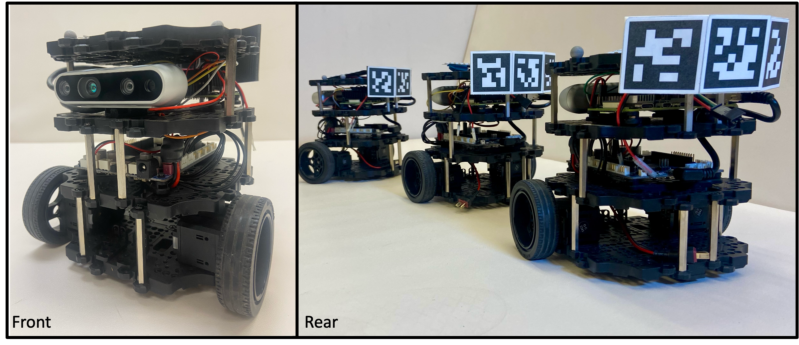

# Human-Led Decentralized Constant-Spacing Robot Platoons without Communication

## 📌 Overview

Decentralized constant-spacing platooning (CSP) typically relies on inter-robot communication to prevent string instability, where spacing errors grow along the platoon. In many scenarios, however, communication is unavailable or unreliable due to ad-hoc deployment, security, or jamming constraints.

This work introduces a communication-free, string-stable platooning strategy using Delayed Self-Reinforcement (DSR), achieving arbitrarily small spacing errors given sufficiently high sensing rates.

This repository accompanies the paper: 

**[🚧TODO: add paper link]**

## 🏗️ System Architecture

- **Mobile Robot:** TurtleBot3 ([document](https://emanual.robotis.com/docs/en/platform/turtlebot3/overview/))
- **Requirements:** Ubuntu 20.04, ROS Noetic, C++, Python
- **Leader:** Human-controlled robot (manual keyboard / joystick)
- **Follower:** Autonomous robots track predecessor using onboard camera (relative pose)
  - **Sensing:** AprilTag pose detection through D435i camera   
    - Launch package `camera_multi_tag`               
  - **Controller:** Track predecessor using AprilTag pose detection 
    - Launch package `tracking` 
    - Logitudinal control mode: `P`(CSP) or `DSR`(D-CSP)  
    - Orientation control mode: `LOS`(line of sight) or `PC`(path curvature)
  - **Lighting:** LED pad on the robot indicates visual contact status
    - Launch package `lighting`
    - Light status:  
      😊(green) good for field of view (FOV)  
      😐(yellow) attention needed  
      😞(red) potentialFOV loss

## ⚙️ Installation

## ▶️ Usage

  **[🚧TODO: add smth]**

## 🎥 Demo

Watch the demo on YouTube:

[Watch the demo on YouTube](https://youtu.be/_Z-6x9xi1LY)

# Important rospackages
1. camera_multi_tag: launch `image_publisher.py` and `cam_multi_tag_node` to dectect Aruco marker
2. camera_multi_tag_2: launch `cam_multi_tag_2.py` to detect Apriltag
3. tracking: tbot controller 
4. tbot_launch: Main launch file

# Usage
Master device: Either henrypcl (IP:192.168.0.159) or the Alienware laptop (IP: NEED TO CHECK)

## Cmd window 1 - Leader teleoperation:
1. Setup Turtlebot model & Turtlebot namespace

`export ROS_MASTER_URI=...` (if needed)

`export TURTLEBOT3_MODEL=burger` 

`export ROS_NAMESPACE=tbot165`

`roslaunch turtlebot3_teleop turtlebot3_teleop_key.launch`

## Cmd window 2 - Bringup and open camera:
2. Bringup all Turtlebots
3. Launch the camera and Apriltag detection nodes

`roslaunch tbot_launch tbot_launch_mock.launch`

In the launch file:
- If the master PC is henrypcl use line 5: `<arg name="env" default="/opt/ros/noetic/env_henry.sh"/>`
- If the master PC is Alienware use line 6: `<arg name="env" default="/opt/ros/noetic/env_alien.sh"/>`

## Cmd window 3 - Run DSR or baseline controller:
4. Launch controller  

`roslaunch pd_tracking_xy pd_tracking_xy.launch`
