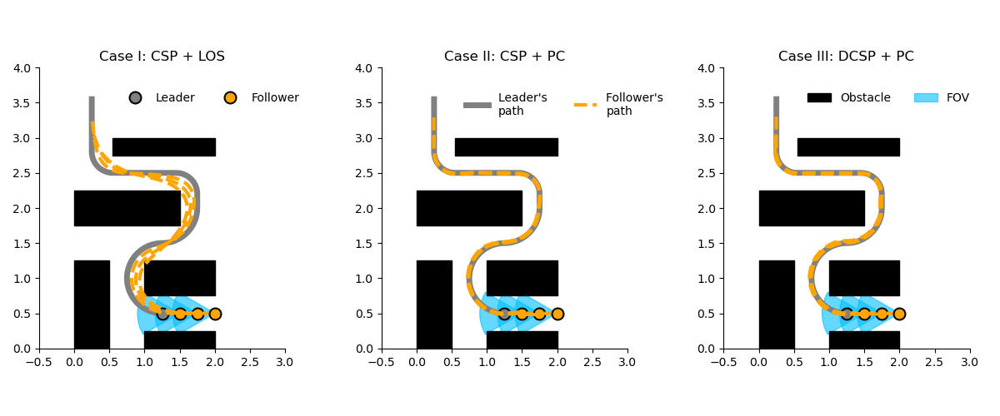

# CSP Simulation

This is a differential-drive robot simulation for constant spacing platooning (CSP) and the proposed DSR-augmented CSP (DCSP) using line of sight (LOS) or path curvature (PC) orientation tracking.

## GIF Preview
If `simulation.gif` is present in this directory, GitHub will render it automatically in the file preview and the image will animate.

Embed it in Markdown with:

```md

```

## Run the simulation
Execute the notebook `csp_simulation.ipynb` to generate the simulation results and `simulation.gif`.

## Notes
- `simulation.gif` can be viewed directly in VS Code image preview.
- If committed and pushed, GitHub will display the animated GIF in the repo.
